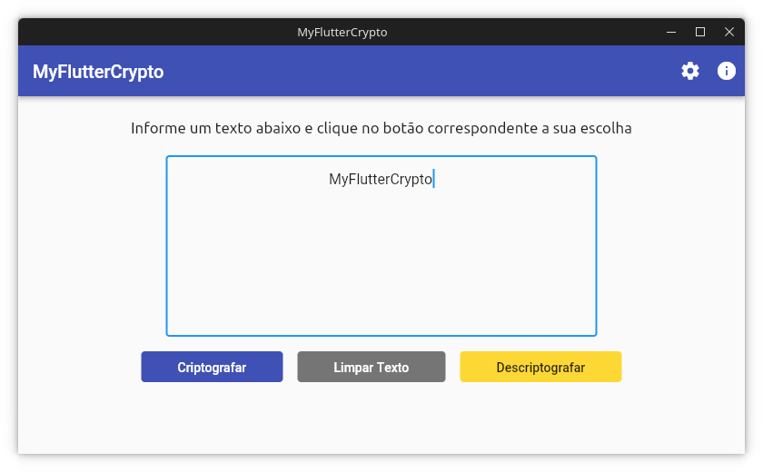

# MyFlutterCrypto 🔓

  

Favorite ⭐ o repositório se você gostar do que vê 😉.

:memo: Traduções disponíveis:
[ 🇺🇸 ](../../../README.md)
 [  🇧🇷  ](README.md) . Veja este documento em outras linguagens em
 [docs/i18n](../).

## About

MyFlutterCrypto é um aplicativo multiplataforma que permite criptografar e descriptografar textos de forma simples.

Para fazer o download e obter maiores informações visite a [Wiki](https://github.com/tglima/myfluttercrypto/wiki/Início).

## Requisito para construir uma versão desktop
* Um sistema operacional (ex. MacOS X, Linux, Windows)
* [Flutter](https://flutter.dev/docs/get-started/install)  v2.5.x
* Uma IDE com suporte ao Flutter SDK instalado (ex. [IntelliJ](https://www.jetbrains.com/idea/download/), Android Studio, [VSCode](https://code.visualstudio.com/Download) etc)
* [Suporte a aplicações desktop ativos na configuração do Flutter](https://flutter.dev/desktop)
* Requisitos adicionais para [Windows](https://flutter.dev/desktop#additional-windows-requirements)
* Requisitos adicionais para [Linux](https://flutter.dev/desktop#additional-linux-requirements)

## License
O código fonte desta aplicação está sob [Licença MIT](../../../LICENSE), todo o restante deve ser considerado conteúdo registrado dos seus respectivos proprietários e desenvolvedores.
